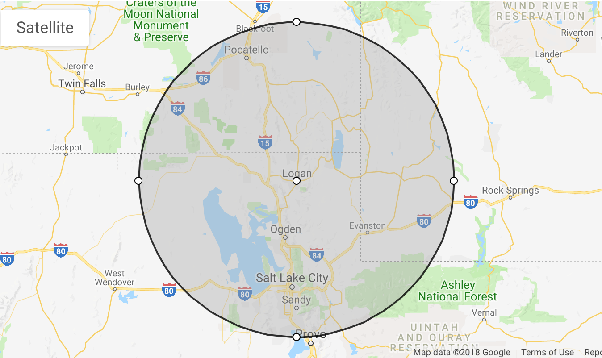

# Machine Learning with Tinder - Information Retrieval (CS4320)
For those of you whom aren't familiar, Tinder is a popular online dating platform typically used on mobile devices. A user is presented with pictures and other information about local singles allowing the user to "like" or "pass" on their profile.  
This project collects information from Tinder profiles, analyzes the biography section text, and applies clustering to determine popular topics expressed.  
Expansion on this project could include attempting to compose an "optimal" profile to maximize matches based on the collected information.

## Results
### Top 5 Topics Expressed
  

### Collection Statistics
* 2790 total profiles collected
* 2060 profiles with usable biography text

## Procedure
### Data Collection
1. Obtain a Facebook token to authenticate with the Tinder API.
2. Request the recommended profiles.
3. Save the biography text to a JSON file.
4. "Like" each recommended profile.
5. Repeat steps 2 - 3 until no more likes available.
6. Repeat steps 2 - 5 when more likes are available (every 12 hours).  
### Collection Radius:
Women within a 100 mile radius of Logan, UT from the ages of 18+

### Data Analysis
1. Preprocess the text (Remove: Stop Words, Punctuation, Emojis, and Numbers).
2. Feature extraction from the documents (Each Tinder profile is a document): TF-IDF.
3. Perform clustering: Truncated SVD (Latent Semantic Analysis)